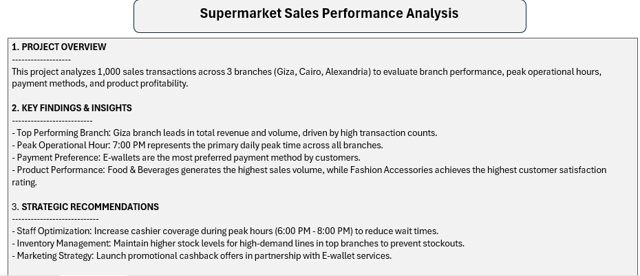
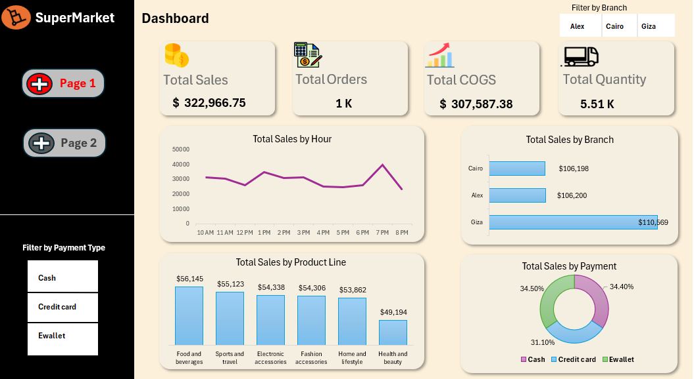
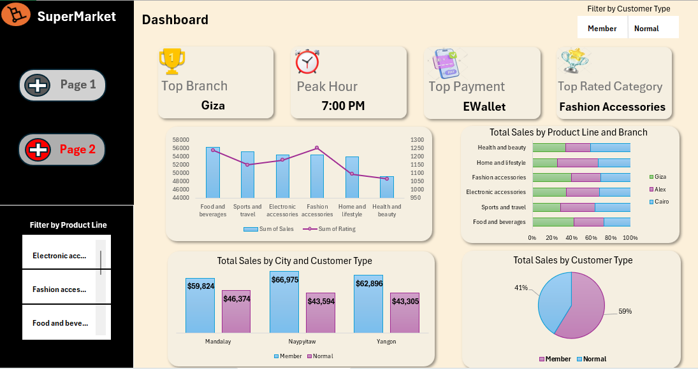

# 🛒 Supermarket Sales Performance Analysis

An end-to-end interactive data analysis project built in **Microsoft Excel** to evaluate supermarket sales performance across 3 primary branches (Giza, Cairo, and Alexandria).

---

## 📊 Dashboards & Executive Summary

### Executive Overview & Strategic Recommendations

### Executive Dashboard (Page 1)

### Deep-Dive Analysis Dashboard (Page 2)

---

## 🔍 Key Findings & Business Insights

* **Top Performing Branch:** **Giza** leads in total revenue ($110.5K) and transaction volume.
* **Peak Hours:** Daily sales reach their highest peak at **7:00 PM** across all branches.
* **Payment Methods:** **E-wallets** are the most preferred payment method (~34.5%).
* **Product Performance:** **Food & Beverages** achieves the highest sales volume, while **Fashion Accessories** scores the highest customer satisfaction rating.

---

## 💡 Strategic Recommendations

1. **Staffing:** Increase cashier availability during peak hours (6:00 PM – 8:00 PM) to reduce customer wait times.
2. **Inventory Management:** Maintain higher inventory levels for high-demand product lines in top-performing branches to avoid stockouts.
3. **Marketing Strategy:** Partner with E-wallet providers to launch promotional cashback campaigns.
4. **Quality Enhancement:** Review quality assurance for Food & Beverages to elevate satisfaction ratings to match its sales volume.

---

## 📁 Repository Structure

* `SuperMarket Analysis(2).xlsx` - Complete Excel Workbook containing Raw Data, Clean Data (Power Query), Pivot Tables, and Interactive Dashboards.
* `README.md` - Project documentation and summary.

---

## 🛠 Tools Used

* **Microsoft Excel:** Power Query, Pivot Tables, Data Formatting, Slicers, and Custom Dashboards.
